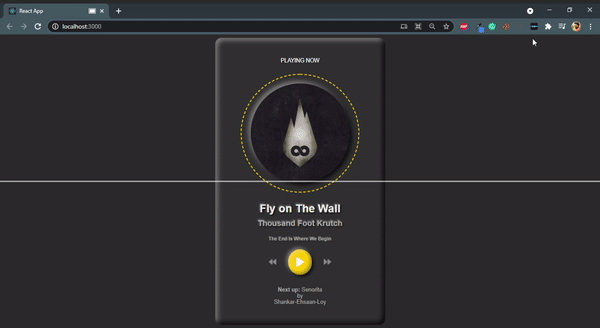
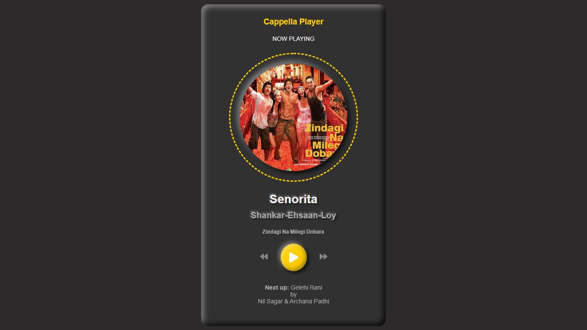

# Cappella Music Player
demo: https://music-player-appl.web.app/

## Sample video

## Sample Picture

 
## Cappella Player : (using React JS)

  This is a sample music application via you can listen music stored in the internal memory.

  Related terms: AAC (Advanced Audio Coding)  

 

## Start with Clone this Sales Plus App

To clone this project (https://github.com/Rashmiranjantandia/music-player.git).

## Available Scripts

In the project directory, you can run below command:

### `npm start`

## To Runs the app in the development mode.
Open [http://localhost:3000](http://localhost:3000) to view it in the browser.

The page will reload if you make edits.
You will also see any lint errors in the console.

# Thank You
